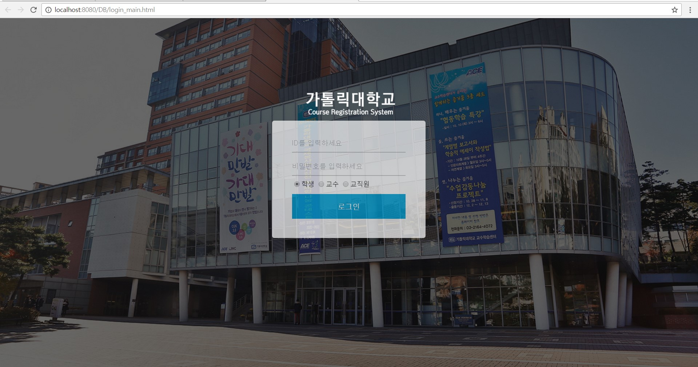
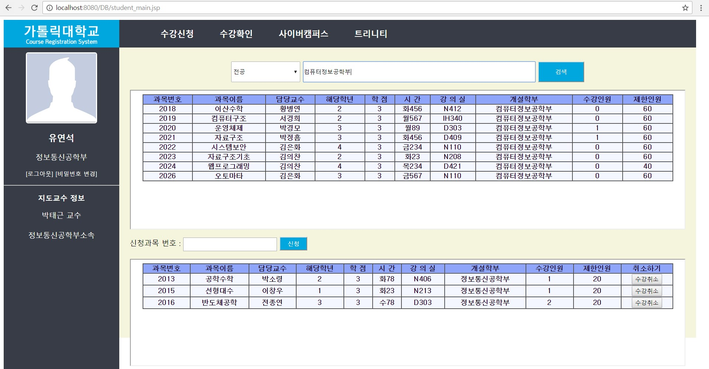

# Application-for-Classes-Program2016
  가톨릭대학교 모의 수강신청 프로그램

#### 개발언어
- 운영체제 : WINDOW10
- 개발언어 : JSP
- 사용서버 : 톰캣 7.0v
- DBMS : ORACLE11 / SQLplus(현재_2018 DB 닫음)

#### 프로젝트 담당 역할
- 제안서 작성 / UI제작 / DB제작 및 관리 / JSP 기능 구현 / 결과보고서 작성

#### PREVIEW
- 로그인 페이지 -> 학생/교수/관리자

- 학생 메인페이지

- 수강신청 및 검색

- 교수 메인페이지

- 관리자 메인페이지

#### 보다 자세한 결과 이미지는 실행이미지.docx에서 확인할 수 있습니다.
